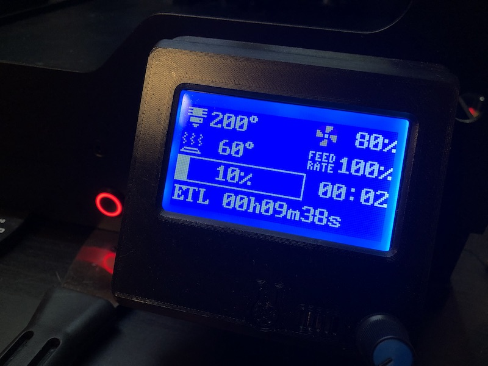

# SK200 
Klipper configuration for my Zortrax M200 printer



## Setup
I'm running [klipper firmware](https://github.com/KevinOConnor/klipper) on a RaspberryPi3 connected via usb to an SKR 1.3 board.

### Klipper and Octoprint
The process is pretty straight-forward: run the klipper dependencies installer, compile the firmware and flash it on the board. Install an octoprint plugin. It's done :)

Please refer to the [offical documentation](https://www.klipper3d.org/Overview.html) for details.

### How to load klipper configuration
At the moment I checked out this repository in my home directory and added a static `printer.cfg` just to include these files.
```bash
git clone https://github.com/rpanfili/sk200.git ~/sk200
echo "[include ./sk200/printer.cfg]" > ~/printer.cfg
```

### Additional wiring

board pin | connected to
-|-
X MAX | PSU relay module (HIGH to shutdown)
Y MAX | Filament runout sensor (LOW on runout)

## Hardware
- **Zortrax M200**: the original printer, the starting point of this project
- **SKR v1.3**: the mcu that drives the printer firmware
- **RaspberryPi 3**: a credit card sized computer, running linux

- **TMC 5160 drivers**: actually drive the motors via **software SPI**
- **Wantai 0.9° steppers**: nema 17, X and Y steppers (42BYGHM810)
- **StepperOnline 1.8° pancake**: nema 17, short sized (20mm) stepper, used on the BMG extruder (17HS08-1004S)
- **Moons 1.8° stepper**: nema 17, drives Z axis
- **Bondtech BMG dual drive extruder**: drives the filament
- **MASP custom hotend (e3d style)**: aluminum heatsink with titanium heatbreak
- **Liftbag copper heating block**: custom heat block with minimal size, made by Paolo Buongarzone
- **50W 24V Heater**: ceramic cartridge, 6*20mm
- **e3d copper thermistor**: thermistor cartridge
- **24V white led strips**: to light up the printing chamber
- **Lerdge power module**: to drive the PSU
- **Lerdge bed mosfet module**: to drive the bed heater
- **Lerdge filament sensor**: to detect filament runouts
- **RepRap 12864 expansion board**: the external display, with the buzzer
- **Z-BED3**: custom aluminum bed, gold plated to print without raft


## Contributing

This project, even if personal, it's meant open so feel free to contribute! 
These are the [contribution guidelines](CONTRIBUTING.md).
